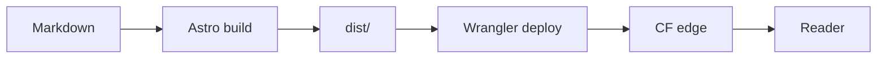

This post exists to exercise every rendering and validation path in graphite.
If you are reading this on the deployed site, then the static build, the image
pipeline, the OG generator and the AnimML compiler all agreed to ship together.

If you are reading this in a local checkout, the markdown body below is meant
to drive `pnpm validate`, `pnpm lint:md` and `pnpm build` to a clean exit.

## Typography

Body copy sits on a roughly 65ch measure, set in Monaspace Neon at a generous
line-height. Inline elements include **strong emphasis**, _italic emphasis_,
`inline code`, [internal links](/hello-world/) and
[external links](https://astro.build/). The em dash — like that one — should
breathe with hair-thin space around it, courtesy of the variable font.

### A short paragraph after H3

Headings should descend without skipping levels. The validator rejects an H2
followed by an H4, and the rendered hierarchy here exists to confirm it.

## Lists

A flat unordered list:

- First item, leading with a clear verb.
- Second item, with `inline code` mid-sentence.
- Third item, ending with a [link to a public source](https://github.com/withastro/astro).

A flat ordered list:

1. Author writes the post.
2. Pre-commit validators check schema, body and AnimML blocks.
3. CI builds the static bundle and pushes originals to R2.
4. Wrangler deploys the Worker.

A nested list to confirm indentation rules:

- Build pipeline
  - `pnpm validate` runs all three validators
  - `astro build` emits the static site
  - `assert-build` gates the deploy
- Runtime pipeline
  - Worker serves `/images/*.avif`
  - Static assets handled by Cloudflare Pages-style routing
  - Custom `_headers` adds security headers

## Quoted thought

> Premature optimization is the root of all evil, yet a fast site is a feature.
> The trick is to do the optimization once, at build time, and never again at
> runtime — which is exactly what a static blog on the edge gives you.

## Code, in many languages

TypeScript, for the Worker:

```typescript
interface Env {
  R2: R2Bucket;
  IMAGES: ImagesBinding;
}

export default {
  async fetch(req: Request, env: Env): Promise<Response> {
    const url = new URL(req.url);
    const object = await env.R2.get(url.pathname.slice(1));
    if (!object) return new Response('Not Found', { status: 404 });
    return new Response(await object.arrayBuffer(), {
      headers: { 'cache-control': 'public, max-age=31536000, immutable' },
    });
  },
};
```

Bash, for one-off ops:

```bash
pnpm fetch:font
pnpm gen:font-fallback
pnpm build
pnpm exec wrangler deploy
```

JSON, for a typical frontmatter-as-data export:

```json
{
  "title": "Feature tour",
  "date": "2026-05-13",
  "tags": ["meta", "reference", "tour"]
}
```

Python, for a one-off content audit:

```python
from pathlib import Path
import frontmatter

for md in Path("content/posts").glob("*.md"):
    post = frontmatter.load(md)
    if not post.get("description"):
        print(f"missing description: {md.name}")
```

Rust, because Monaspace was made for it:

```rust
fn ascii_only(s: &str) -> bool {
    s.bytes().all(|b| b < 128)
}

fn main() {
    let title = "feature tour";
    assert!(ascii_only(title));
    println!("{}", title.to_uppercase());
}
```

CSS, illustrating a token from the design system:

```css
:root {
  --bg: #181818;
  --fg: #e6e6e6;
  --accent: #8faacc;
  --measure: 65ch;
}

main {
  max-width: var(--measure);
  margin-inline: auto;
  color: var(--fg);
  background: var(--bg);
}
```

A unified diff, for the language detector and the diff theme:

```diff
- "deploy": "npm run build && wrangler deploy",
+ "deploy": "pnpm run build && wrangler deploy",
```

## Image

Below: a generated PNG that exercises the responsive-image pipeline. The
Markdown source is a plain ``; the remark plugin emits
an `` with explicit `width`, `height` and an AVIF `srcset`.


## Table

Build outputs at a glance:

| Artifact                | Where                   | Cache policy                  |
| ----------------------- | ----------------------- | ----------------------------- |
| `dist/index.html`       | static bundle           | short, revalidate on deploy   |
| `dist/og/home.png`      | static bundle           | year, immutable               |
| `dist/rss.xml`          | static bundle           | minutes, revalidate           |
| `images/*.png`          | R2 bucket               | year, immutable, hash-keyed   |
| `images/*@*.avif`       | R2 bucket + edge cache  | year, immutable, hash-keyed   |

## A Mermaid diagram

If `rehype-mermaid` and Playwright Chromium are installed, this renders as an
inline SVG; otherwise it falls back to a plain code block.



## An AnimML diagram

The block below is parsed and compiled at build time into an inline SVG with
CSS keyframes and SMIL motion paths — no client-side runtime required.

```anim
[16:9 graphite-neon "Request flow"]
duration: 4000

use browser as client at(18, 50) label:"Browser"
use server as api at(50, 50) label:"Worker" color:cyan
use cylinder as store at(82, 50) label:"R2" color:purple

-> client -> api as req label:"GET /post"
-> api -> store as fetch label:"read" color:cyan
-> store -> api as resp label:"data" color:purple .return

state idle:
  dim *
state requesting:
  highlight client
  flow req
state reading:
  active api
  flow fetch
state done:
  active store
  flow resp

idle --[800ms ease-out]--> requesting
requesting --[1000ms ease-in-out]--> reading
reading --[1200ms ease-in-out]--> done
done --[1000ms ease]--> idle
```

---

## Wrap-up

If everything above renders without console errors, the post pipeline is
healthy end-to-end: frontmatter parsed, body lint clean, code highlighted,
image served from R2 as AVIF, OG card generated, RSS and sitemap updated,
and the AnimML block compiled into an SVG that animates without a single
byte of JavaScript on the page.

See you in [the next post](/hello-world/).
